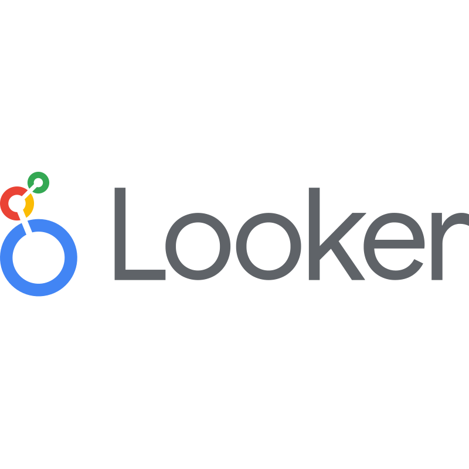

<!-- TOPO: IMAGEM + TEXTO -->

<table>
  <tr>
    <td valign="top" width="75%">

<h1>
Leonardo Carvalho
</h1>

<strong>👋 Sobre mim</strong>

Sou <strong>meteorologista</strong> com formação técnica em <strong>Desenvolvimento de Sistemas</strong> e <strong>Geoprocessamento</strong>.

Atuo em <strong>geoprocessamento, análise de dados ambientais, sensoriamento remoto, fotogrametria e automação</strong>, aplicando ciência e tecnologia para transformar dados brutos em <strong>informação técnica confiável</strong>.

Tenho experiência na geração de produtos e análises voltadas a <strong>projetos ambientais, territoriais, urbanos e rurais</strong>, apoiando diretamente a <strong>tomada de decisão</strong>.

<strong>Atualmente</strong>, trabalho com:

<ul>
  <li>🌍 Mapas temáticos e análise geoespacial</li>
  <li>📍 Topografia e georreferenciamento</li>
  <li>🚁 Drones e fotogrametria</li>
  <li>🛰️ Imagens de satélite</li>
  <li>📊 Análise e visualização de dados</li>
  <li>⚙️ Automação com Python</li>
</ul>

<strong>🧠 Habilidades Técnicas</strong>

      <ul>
          <li>🐍 <strong>Python</strong> – Automação, análise de dados, scripts e processamento</li>
          <li>📊 <strong>Power BI</strong> – Painéis, indicadores e relatórios estratégicos</li>
          <li>📈 <strong>Excel</strong> – Tratamento, modelagem e controle de dados</li>
          <li>🌍 <strong>QGIS / ArcGIS</strong> – Geoprocessamento e análise espacial</li>
          <li>📐 <strong>AutoCAD Civil 3D</strong> – Projetos, topografia e desenho técnico</li>
          <li>🚁 <strong>Drones e Fotogrametria</strong> – Aerolevantamento e produtos cartográficos</li>
          <li>🛰️ <strong>Sensoriamento Remoto</strong> – Imagens orbitais e monitoramento ambiental</li>
          <li>🗄️ <strong>Banco de Dados</strong> – MySQL, SQLite e integração de fontes diversas</li>
      </ul>

  
   <td align="center" width="25%">
  <!---->
  <!--  -->
        
  </tr>
</table>

 

---

## 📫 Contato

---

## 🚀 Tecnologias

<!-- 

  
  
  
  
  
  
  
  
  

-->

<table>
  <tr>
    <td align="center">
      
    </td>
    <td align="center">
      
    </td>
    <td align="center">
      
    </td>
    <td align="center">
      
    </td>
    <td align="center">
      
    </td>
    <td align="center">
      
    </td>
     <td align="center">
      
    </td>
    <td align="center">
      
    </td>
    <td align="center">
      
    </td>
    <td align="center">
      
    </td>

    
  </tr>
</table>
